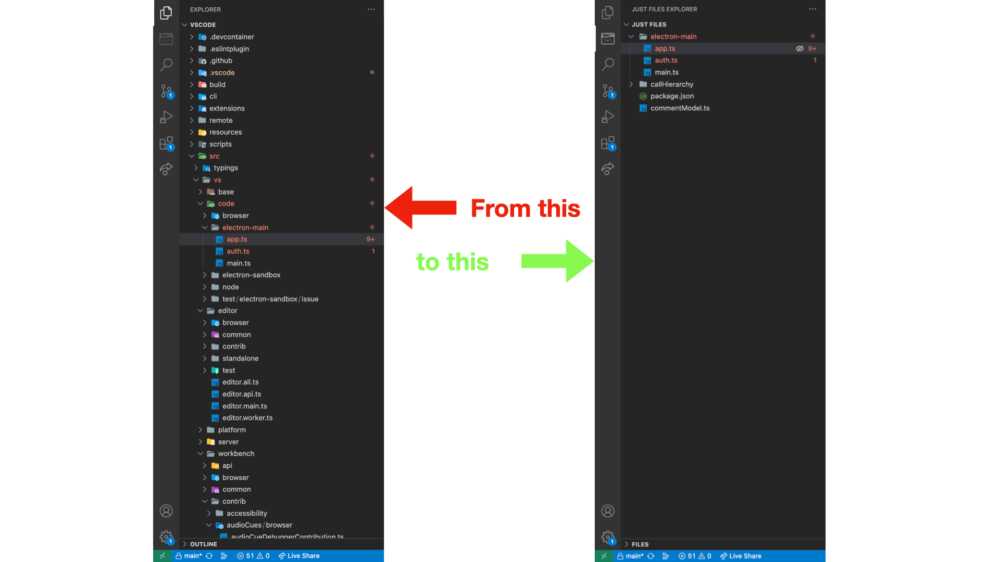
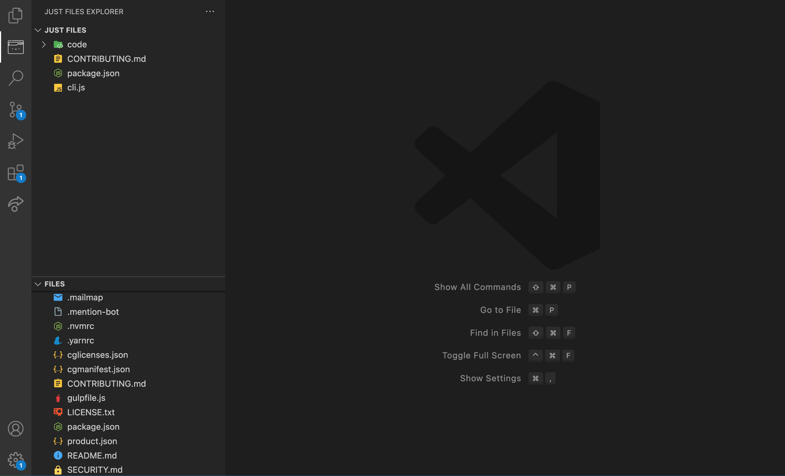
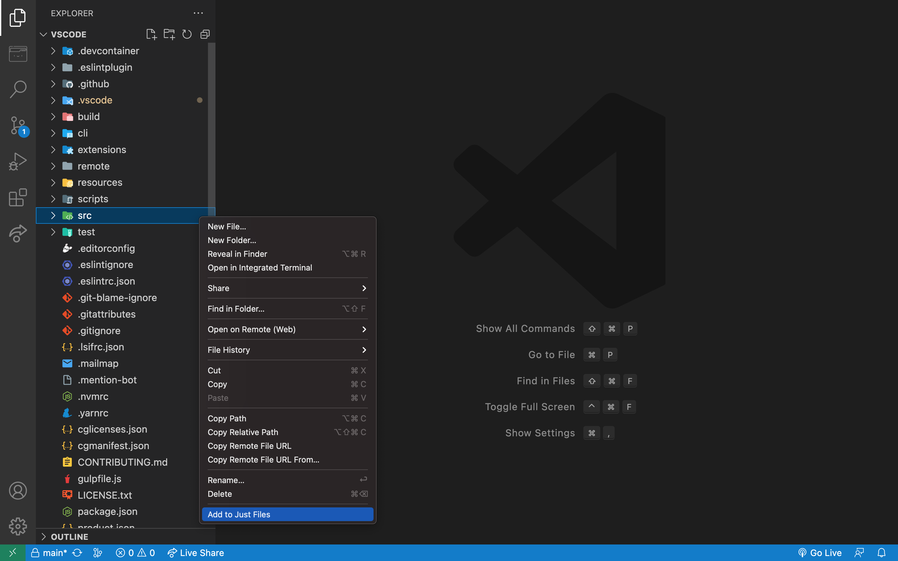
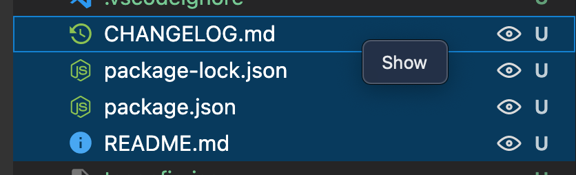

# Just Files
## _Use just the files you need!_ 🤠📁

Avoid wasting time looking for a file among a large number of files or directories. Just Files helps you to select only the ones you need.

## How does it work?
- Install the extension
- Open one or more folders in your workspace
- Open the Just File Explorer
- Two views are displayed: Files and Just Files
    - `Files` displays all your files from workspace
    - `Just Files` displays the files you selected to be displayed
- Add files to Just Files (review <a href="#addFiles">Add files section</a>):
    - In your explorer, right click on item and click on 'Add to Just Files'
    - In Files view, click on show icon for add the file to Just Files view
    - In tab, right click on item tab and click on 'Add to Just Files'
    - Use the command `"cmd"+"y"`
- In Just Files, you can open the files. If you want to remove from the view click on hide icon
- ✨ Enjoy your files ✨

## Demo

## Views

## 
Add files

Apart of using the icons, you have many options for add or remove files from Just Files View:

- Add files from Explorer

- Select multiple files and select the menu (You can click on one icon too):

- From tab menu:

- Use commands:

    - Add: `"cmd"+"y"`

    - Remove: `"cmd"+"alt"+"y"`

All changes made in your workspace will be reflected in `Files` and `JustFiles` views in real time 🚀
## License

MIT

Icon designed by Freepik: www.freepik.com